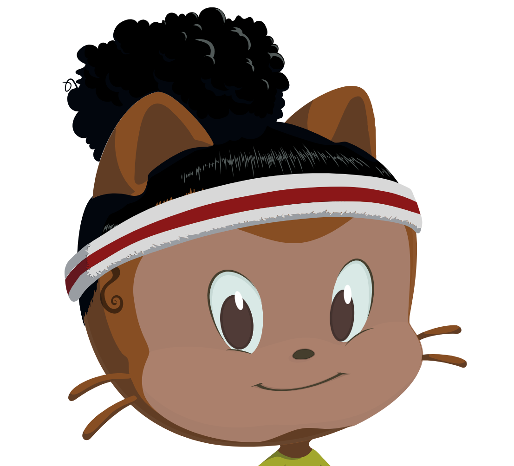

  

# Projetinho de Curso em Vídeo

Este conteúdo foi feito com auxílio do curso de Desenvolvimento Web do professor _Gustavo Guanabara_ — [Curso em Vídeo](https://www.cursoemvideo.com/curso/html5-css3-modulo1/aulas/modulo-1-2/modulos/conteudo-para-o-curso-de-html5-e-css3/)

## Índice

* [Portfólio Web](/Perfil-portfolio-web/)
* [Central de vídeos externos](https://github.com/OneIsaque/portifolio-web) — uma coleção com vídeos de músicas web dentro do site.
